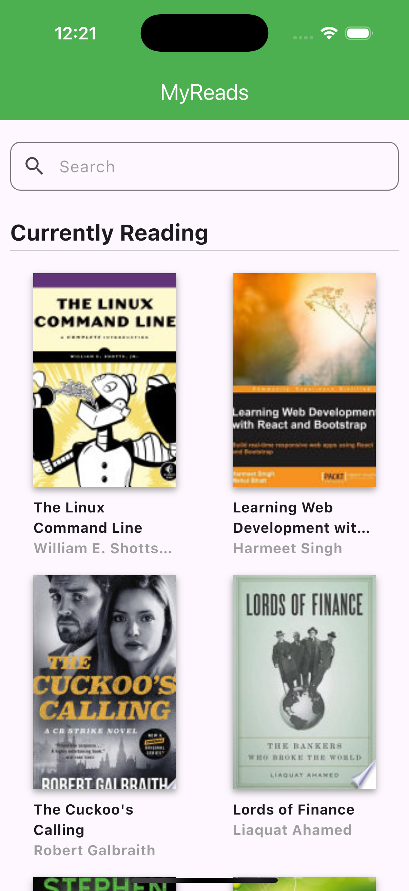
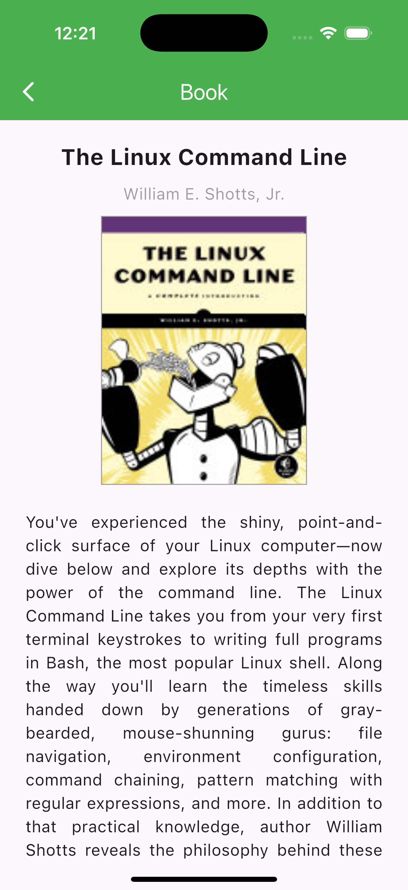

# MyReads (Français)

`MyReads` est un projet exemple construit avec Flutter qui implémente le modèle **BLoC** (Business Logic Component) pour démontrer comment structurer une application avec des **bonnes pratiques** et une **architecture en couches**. Ce projet est conçu pour être modulaire, évolutif et facile à maintenir, en utilisant les principes de séparation des responsabilités.

[English](./README.md) | [Español](./README.es.md) | [Français](./README.fr.md) | [日本語](./README.jp.md)

## Description du Projet

L'objectif principal de ce projet est de présenter une approche pratique pour organiser une application Flutter, en implémentant le modèle BLoC pour gérer la logique métier et assurer une séparation claire des couches. En outre, des **fichiers barrel** sont utilisés pour faciliter les exportations et améliorer la lisibilité du code.

Le projet simule une application de livres où les utilisateurs peuvent naviguer dans diverses pages liées aux livres, telles qu'une liste de livres, des détails, etc.

## Fonctionnalités

- **Architecture en Couches** :
  - **Bloc** : Gestion de la logique métier avec des événements et des états.
  - **Core** : Contient la configuration principale et les fournisseurs globaux de l'application, comme le routage et les thèmes.
  - **Repositories** : Encapsulent l'accès aux données (mock ou APIs).
  - **Models** : Représentation des données utilisées dans l'application.
  - **Widgets** : Composants d'interface utilisateur réutilisables.
  - **Screens** : Pages de l'application organisées par fonctionnalité.

## Captures d'Écran

| **Accueil** | **Détail du Livre** |
|:-----------------------:|:-----------------------:|
|  |  |